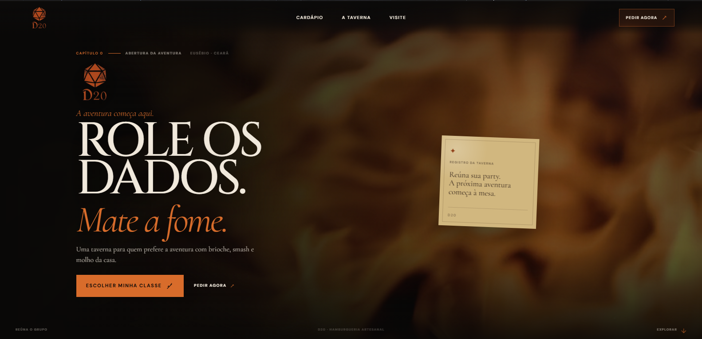

# D20 Hamburgueria

> **Role os dados. Mate a fome.**

Landing page institucional e comercial da **D20 Hamburgueria**, localizada em Guaribas, Eusébio — Ceará. O projeto transforma a identidade de uma hamburgueria artesanal em uma experiência digital inspirada em **RPG de mesa**, usando a linguagem de taverna, ficha de personagem, quest, dados e mapa sem recorrer a estética de videogame.

---

## Ficha técnica

| Item | Detalhe |
|---|---|
| **Projeto** | D20 Hamburgueria |
| **Tipo** | Landing page / site comercial |
| **Local** | Guaribas · Eusébio · Ceará |
| **Frontend** | React 19 |
| **Build tool** | Vite 8 |
| **JavaScript** | ES Modules |
| **3D** | Three.js + React Three Fiber |
| **3D helpers** | @react-three/drei |
| **Animação** | GSAP + ScrollTrigger + Motion |
| **Estilo** | CSS puro / CSS por componente |
| **Tipografia** | Cinzel, Cormorant Garamond e DM Sans |
| **Modelo 3D** | `public/models/d20.glb` |
| **Vídeo principal** | `public/videos/fire.mp4` |
| **Logo** | `src/assets/d20Logo.png` |
| **Imagem social** | `public/og-image.png` |
| **Entrada da aplicação** | `src/main.jsx` |
| **Componente raiz** | `src/App.jsx` |

---

## Conceito

A interface foi construída como se o visitante estivesse entrando em uma pequena **aventura de RPG de mesa**.

A narrativa da página é dividida em capítulos:

1. **Capítulo 0 — Abertura da aventura**
2. **Capítulo I — A Taverna**
3. **Capítulo II — O Cardápio**
4. **Capítulo III — O Destino**
5. **Capítulo IV — A Localização / Quest**

A ideia é que o usuário não apenas veja produtos, mas percorra uma sequência narrativa:

**entrar na taverna → conhecer a casa → escolher uma classe → receber uma missão → rolar o D20 → descobrir o destino → encontrar a taverna → fazer o pedido.**

O RPG utilizado como linguagem visual é deliberadamente baseado em **RPG de mesa**: papel, pergaminho, mapas, fichas, dados, registros e linguagem de aventura.

---

# Arquitetura da aplicação

O fluxo principal começa em `App.jsx`:

```text
App
├── Header
├── main
│   ├── Hero
│   ├── Marquee
│   ├── Tavern
│   ├── MenuSection
│   ├── Quest
│   ├── FateRoll
│   ├── Visit
│   └── FinalCTA
└── Footer
```

O `App.jsx` também centraliza as animações globais feitas com GSAP e ScrollTrigger.

---

## Estrutura de diretórios

```text
d20/
└── d20-burguer/
    ├── public/
    │   ├── models/
    │   │   └── d20.glb
    │   ├── videos/
    │   │   └── fire.mp4
    │   ├── d20Logo.png
    │   └── og-image.png
    │
    ├── src/
    │   ├── assets/
    │   │   └── d20Logo.png
    │   │
    │   ├── components/
    │   │   ├── Header.jsx
    │   │   ├── Hero.jsx
    │   │   ├── Marquee.jsx
    │   │   ├── Tavern.jsx
    │   │   ├── MenuSection.jsx
    │   │   ├── MenuCard.jsx
    │   │   ├── MenuModal.jsx
    │   │   ├── Quest.jsx
    │   │   ├── FateRoll.jsx
    │   │   ├── D20Scene.jsx
    │   │   ├── Visit.jsx
    │   │   ├── FinalCTA.jsx
    │   │   ├── Footer.jsx
    │   │   └── Icon.jsx
    │   │
    │   ├── data/
    │   │   └── menu.js
    │   │
    │   ├── App.jsx
    │   ├── App.css
    │   ├── index.css
    │   └── main.jsx
    │
    ├── index.html
    ├── package.json
    └── ...
```

> Alguns arquivos de estilo são mantidos junto de seus respectivos componentes, seguindo a organização por componente.

---

# Tecnologias

## React

A aplicação utiliza React para estruturar a interface em componentes independentes.

A composição permite que cada parte da experiência seja desenvolvida e mantida separadamente:

- navegação;
- hero;
- apresentação da taverna;
- cardápio;
- modal dos produtos;
- quest;
- dado interativo;
- localização;
- CTA final;
- rodapé.

O projeto utiliza **React 19.2.x**.

---

## Vite

O projeto utiliza Vite como ferramenta de desenvolvimento e build.

Scripts disponíveis:

```bash
npm run dev
npm run build
npm run preview
npm run lint
```

### Desenvolvimento

```bash
npm install
npm run dev
```

### Build de produção

```bash
npm run build
```

### Preview do build

```bash
npm run preview
```

### Lint

```bash
npm run lint
```

---

# 3D — D20 interativo

Uma das principais características técnicas do projeto é o dado D20 em 3D.

A implementação utiliza:

- **Three.js**
- **React Three Fiber**
- **@react-three/drei**
- **GSAP**

O modelo é carregado de:

```text
public/models/d20.glb
```

A cena é criada pelo componente:

```text
src/components/D20Scene.jsx
```

## Como o dado funciona

O resultado de uma rolagem é um número entre **1 e 20**.

Cada resultado possui uma orientação previamente definida no objeto `D20_TARGETS`.

O fluxo é:

```text
Usuário solicita uma rolagem
        ↓
Número aleatório entre 1 e 20
        ↓
Resultado é armazenado no estado React
        ↓
rollToken é incrementado
        ↓
D20Scene inicia a animação
        ↓
Dado realiza rotações
        ↓
Dado termina na face correspondente
        ↓
Resultado seleciona uma classe do cardápio
        ↓
Ficha do aventureiro aparece
```

A rotação não é simplesmente aleatória visualmente: a animação termina na orientação correspondente à face sorteada.

O componente também utiliza `useGLTF.preload()` para antecipar o carregamento do modelo.

---

# Sistema de classes

O cardápio funciona como um sistema de personagens.

Atualmente existem **10 opções**:

| Código | Classe | Tipo |
|---|---|---|
| D01 | Ladino | Hambúrguer |
| D02 | Mago | Hambúrguer |
| D03 | Caçador | Hambúrguer |
| D04 | Bárbaro | Hambúrguer |
| D05 | Bruxo | Hambúrguer |
| D06 | Guerreiro | Hambúrguer |
| D07 | Monge | Hambúrguer |
| D08 | Alquimista | Hambúrguer |
| D09 | Mímico | Hambúrguer |
| D10 | Bardo | Hot Dog |

Os dados estão centralizados em:

```text
src/data/menu.js
```

Isso evita espalhar informações comerciais diretamente pelos componentes.

---

# Fonte de dados

O arquivo `src/data/menu.js` centraliza três grupos principais:

## Produtos

Cada produto possui:

```js
{
  code,
  name,
  type,
  price,
  description,
  image,
  phrase
}
```

Isso permite que os componentes reutilizem as mesmas informações.

O mesmo objeto alimenta diferentes partes da experiência, incluindo:

- cards do cardápio;
- modal;
- rolagem do D20;
- resultado da ficha sorteada;
- galeria.

---

## Horários

Os horários também ficam centralizados:

```js
export const hours = [
  ['Segunda', '18h às 22h'],
  ['Terça', 'Fechado'],
  ['Quarta', '18h às 22h'],
  ['Quinta', '18h às 22h'],
  ['Sexta', '18h às 23h'],
  ['Sábado', '18h às 23h'],
  ['Domingo', '18h às 22h'],
]
```

A seção de localização consome esses dados dinamicamente.

---

## Links comerciais

Os principais destinos externos também ficam centralizados:

- sistema de pedidos;
- WhatsApp;
- iFood;
- Instagram;
- Google Maps;
- avaliação da empresa;
- transporte.

Isso permite atualizar os destinos sem procurar URLs espalhadas pelos componentes.

---

# Seções

## Hero

O Hero funciona como a **capa da aventura**.

Elementos principais:

- logo da D20;
- vídeo de fogo;
- Capítulo 0;
- localização;
- chamada principal;
- descrição;
- CTA para o cardápio;
- CTA de pedido;
- indicação de exploração.

O vídeo utilizado é:

```text
public/videos/fire.mp4
```

A animação de entrada e o efeito de escala durante o scroll são controlados pelo GSAP.

---

# Marquee

O marquee funciona como uma faixa de transição entre capítulos.

Ele utiliza uma lista de termos relacionados à identidade da marca:

```text
SMASH ARTESANAL
MOLHOS DA CASA
EUSÉBIO
REÚNA O GRUPO
D20
ROLE OS DADOS
FOME DE AVENTURA
HAMBÚRGUER ARTESANAL
QUEST DA FOME
A TAVERNA
SABOR CRÍTICO
ESCOLHA SUA CLASSE
PARTY COMPLETA
BATALHA CONTRA A FOME
RECOMPENSA DESBLOQUEADA
MESA POSTA
```

O conteúdo é duplicado para criar o loop visual contínuo.

---

# A Taverna

O componente `Tavern.jsx` apresenta a identidade da hamburgueria dentro de uma composição inspirada em uma ficha/pergaminho.

A seção apresenta:

- Capítulo I;
- registro da taverna;
- localização;
- descrição da D20;
- elementos decorativos inspirados em dados;
- chamada para Instagram;
- mensagem de aventura;
- identidade temática.

O objetivo dessa seção é responder à pergunta:

> **O que é a D20?**

---

# Cardápio

A seção de cardápio é composta por:

```text
MenuSection
├── MenuCard
└── MenuModal
```

O `MenuSection` percorre o array `menu` e cria os cards dinamicamente.

Cada card pode abrir um modal com informações adicionais.

Isso significa que adicionar ou remover um produto não exige alterar manualmente a estrutura do cardápio: basta alterar `src/data/menu.js`.

---

# Quest

A seção de missão transforma o objetivo comercial em uma pequena quest.

Elementos:

- missão disponível;
- número da quest;
- objetivos;
- recompensa;
- abertura do cardápio;
- contato via WhatsApp.

A estrutura narrativa é:

```text
MISSÃO
  ↓
Escolher classe
  ↓
Reunir party
  ↓
Derrotar a fome
  ↓
Receber recompensa
```

É uma camada de storytelling sobre uma ação comercial real.

---

# Destino — D20

A seção `FateRoll` é a parte interativa mais complexa da aplicação.

Ela conecta:

```text
React state
    +
Three.js
    +
React Three Fiber
    +
GSAP
    +
Motion
    ↓
Rolagem do D20
    ↓
Classe sorteada
    ↓
Ficha do resultado
```

O resultado da rolagem determina o produto apresentado.

A função:

```js
getMenuItemFromRoll(number)
```

faz a associação entre o número obtido e o produto.

Assim:

- resultados 1–10 correspondem às dez primeiras entradas;
- resultados 11–20 voltam a mapear para as dez classes existentes.

Isso mantém os vinte resultados do dado, mas utiliza as dez opções atuais do cardápio.

---

# Localização

A seção `Visit.jsx` funciona como uma quest de localização.

Ela apresenta:

- mapa estilizado;
- partida;
- destino;
- D20 Taverna;
- Guaribas;
- Eusébio;
- endereço;
- horários;
- WhatsApp;
- Instagram;
- link para Google Maps.

Endereço atualmente registrado no projeto:

```text
R. Maria Fernandes de Sousa, 58
Guaribas · Eusébio, CE
61769-500
```

---

# CTA final

O `FinalCTA` encerra a experiência retomando o conceito principal:

> **A aventura está servida.**

O usuário recebe novamente uma ação direta para realizar o pedido.

Essa repetição é intencional: depois de percorrer a narrativa, o visitante encontra uma conversão clara no final da página.

---

# Header e navegação

O Header possui:

- logo;
- Cardápio;
- A taverna;
- Visite;
- botão Pedir agora;
- menu mobile.

A navegação interna utiliza `scrollIntoView()` para levar o visitante às respectivas seções.

No mobile, o menu pode ser aberto e fechado pelo botão de navegação.

---

# Footer

O rodapé reúne:

- identificação da D20;
- descrição da hamburgueria;
- mensagem final da aventura;
- Instagram;
- iFood;
- avaliação;
- identificação de Eusébio;
- autoria do desenvolvimento.

---

# Identidade visual

A identidade visual é construída sobre uma paleta escura e quente.

Variáveis principais:

```css
--ink: #0b0a09;
--paper: #f1e9dc;
--muted: #a99f92;
--orange-deep: #8f3d16;
--orange: #b8541d;
--orange-light: #d86c2b;
```

## Tipografia

### Cinzel

Utilizada para elementos de display e linguagem de RPG.

### Cormorant Garamond

Utilizada para textos editoriais e momentos de maior personalidade.

### DM Sans

Utilizada para interface, navegação, informações e elementos funcionais.

---

# Animações

O projeto combina diferentes ferramentas de animação de acordo com a função.

## GSAP

Usado principalmente para:

- entrada do Hero;
- animações de reveal;
- parallax/escala do vídeo;
- linha da Quest;
- animação do D20.

O `ScrollTrigger` controla animações vinculadas ao scroll.

---

## Motion

Usado no resultado da rolagem para controlar a entrada e saída da ficha sorteada.

O resultado possui transições de:

- opacidade;
- posição;
- rotação.

---

# Acessibilidade e comportamento

Algumas decisões técnicas já estão incorporadas:

- `alt` em imagens principais;
- `aria-label` na navegação;
- `aria-expanded` no menu mobile;
- elementos decorativos marcados com `aria-hidden`;
- botões utilizados para ações de interface;
- links externos com `target="_blank"` e `rel="noreferrer"`;
- suporte a `prefers-reduced-motion` em animações globais.

No `App.jsx`, quando o usuário prefere redução de movimento, as animações GSAP de entrada/scroll são evitadas.

---

# Responsividade

A interface foi construída para funcionar em:

- desktop;
- notebook;
- tablet;
- smartphones;
- telas pequenas.

O CSS utiliza principalmente:

- `clamp()`;
- media queries;
- layouts flexíveis;
- grids;
- unidades relativas;
- dimensões adaptativas.

A largura geral das seções é limitada para preservar a leitura em telas grandes.

---

# SEO e compartilhamento

O `index.html` possui estrutura para:

- descrição da página;
- título;
- canonical;
- Open Graph;
- Twitter/X Cards;
- favicon;
- Apple Touch Icon;
- informações de idioma;
- robots.

A imagem utilizada para compartilhamento é:

```text
public/og-image.png
```

Ela é referenciada pelas meta tags Open Graph/Twitter quando o site estiver hospedado em uma URL pública.

> **Importante:** o projeto ainda não possui domínio próprio. Quando houver um domínio definitivo, as URLs absolutas das tags `og:url`, `og:image`, `twitter:image` e canonical devem apontar para o endereço real.

---

# Assets

## Logo

A logo principal está em:

```text
src/assets/d20Logo.png
```

Uma cópia pública pode ser mantida em:

```text
public/d20Logo.png
```

A cópia pública permite que o favicon seja acessado diretamente pelo navegador.

---

## Open Graph

A imagem de compartilhamento fica em:

```text
public/og-image.png
```

Ela deve ser uma imagem pública e acessível diretamente pelo servidor para que serviços externos possam gerar previews de compartilhamento.

---

## Modelo 3D

```text
public/models/d20.glb
```

O modelo é carregado pelo `D20Scene.jsx`.

---

## Vídeo

```text
public/videos/fire.mp4
```

O vídeo é utilizado como mídia de fundo do Hero.

---

# Dependências principais

```json
{
  "react": "^19.2.8",
  "react-dom": "^19.2.8",
  "@react-three/fiber": "^9.8.1",
  "@react-three/drei": "^10.7.9",
  "three": "^0.186.1",
  "gsap": "^3.15.0",
  "motion": "^13.4.6"
}
```

Ferramentas de desenvolvimento incluem:

- Vite;
- ESLint;
- plugin React do Vite;
- ESLint React Hooks;
- ESLint React Refresh.

---

# Performance

O projeto possui alguns pontos importantes para performance:

### 3D sob demanda

O Canvas do React Three Fiber fica concentrado na seção de destino, evitando utilizar WebGL em toda a página.

### Pré-carregamento do modelo

O D20 utiliza:

```js
useGLTF.preload('/models/d20.glb')
```

### Animações

As animações são executadas principalmente através de transformações e opacidade, reduzindo trabalho desnecessário no layout.

### Imagens

Os produtos são carregados conforme as URLs definidas no catálogo.

> Parte das imagens atuais do cardápio utiliza URLs externas. Para uma implantação comercial definitiva, hospedar os assets controlados pelo projeto pode reduzir dependências externas e tornar o comportamento mais previsível.

---

# Links comerciais atualmente configurados

Os links ficam em `src/data/menu.js`.

### Pedidos

```text
D20 Hamburgueria / Saipos
```

### WhatsApp

```text
(85) 98937-9116
```

### Instagram

```text
@d20burger
```

### Localização

Google Maps com busca pela D20 Hamburgueria em Eusébio.

### iFood

O projeto também possui um link direto para o estabelecimento no iFood.

---

# Manutenção

As alterações mais comuns podem ser feitas sem mexer na arquitetura dos componentes.

## Alterar produtos

Editar:

```text
src/data/menu.js
```

## Alterar horários

Editar:

```text
src/data/menu.js
```

## Alterar links

Editar:

```text
src/data/menu.js
```

## Alterar textos de uma seção

Editar o respectivo componente em:

```text
src/components/
```

## Alterar identidade visual

Editar:

```text
src/index.css
```

e os arquivos CSS específicos de cada componente.

---

# Fluxo de desenvolvimento

Uma alteração típica segue:

```text
Editar código
    ↓
npm run dev
    ↓
Testar visualmente
    ↓
npm run lint
    ↓
npm run build
    ↓
Testar build
    ↓
Commit
    ↓
Deploy
```

---

# Deploy

O projeto é uma aplicação Vite/React e pode ser hospedado em plataformas que suportem aplicações frontend estáticas.

O processo de produção consiste em:

```bash
npm run build
```

O resultado é gerado na pasta:

```text
dist/
```

Os arquivos dentro de `public/` são incorporados ao build preservando seus caminhos públicos.

---

# Princípios do projeto

A implementação segue alguns princípios que definem a experiência:

### 1. Identidade antes da tecnologia

A tecnologia deve servir à identidade da D20, e não transformar a página em uma demonstração de tecnologia.

### 2. RPG de mesa, não videogame

A referência principal é:

- mesa;
- papel;
- ficha;
- dado;
- mapa;
- taverna;
- aventura;
- party.

A interface evita deliberadamente:

- HUD;
- neon;
- estética cyber;
- excesso de glow;
- interfaces de MMORPG;
- visual de menu de videogame.

### 3. Narrativa com função comercial

A linguagem de RPG não é apenas decoração.

Cada capítulo conduz para uma ação real:

```text
Conhecer
  ↓
Explorar
  ↓
Escolher
  ↓
Interagir
  ↓
Descobrir
  ↓
Pedir
```

### 4. Dados centralizados

Informações comerciais ficam separadas da apresentação visual sempre que possível.

### 5. Componentização

Cada parte significativa da experiência possui seu próprio componente e estilo.

---

# Estado atual

O projeto atualmente possui uma experiência completa de landing page, incluindo:

- [x] Hero narrativo
- [x] Vídeo de abertura
- [x] Navegação responsiva
- [x] Marquee temático
- [x] Apresentação da taverna
- [x] Cardápio dinâmico
- [x] Modal de produto
- [x] Sistema de classes
- [x] Quest interativa
- [x] D20 3D
- [x] Rolagem funcional
- [x] Resultado vinculado ao cardápio
- [x] Mapa/localização
- [x] Horários
- [x] WhatsApp
- [x] Instagram
- [x] iFood
- [x] CTA final
- [x] Footer
- [x] SEO básico
- [x] Open Graph
- [x] Favicon
- [x] Responsividade
- [x] Reduced motion

---

# Autor

**Richard R. Araújo**

Desenvolvimento frontend e implementação da experiência digital da D20 Hamburgueria.

---

## D20 · Eusébio

**Role os dados. Mate a fome.**
